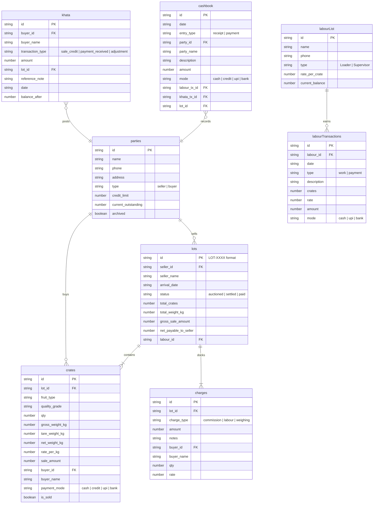

# Kisan Mitra (Mandi Services) — Developer Handbook & Architecture Guide

Welcome to **Kisan Mitra**, a state-of-the-art, offline-first Mandi Commission Agent Management & Ledger system. This document is a comprehensive technical transfer handbook. If you are a new developer taking over this project, this guide will provide a 360-degree understanding of the business domain, system architecture, database design, user interface mappings, and advanced engineering safeguards.

---

## 1. Domain Overview & Business Rationale (The "Why")

In agricultural wholesale markets (known as **Mandis** in South Asia), the key player is the **Commission Agent (Adhatiya or Arhatiya)**. They serve as intermediaries who handle fruit arrivals from farmers (Sellers) and auction them to wholesalers/retailers (Buyers).

### A. The Core Financial Cycle
1. **Lot Arrival**: A farmer brings an arrival of fruit crates (**Lot**). The lot is unseated by a crew of workers (**Loader Gang**).
2. **Auctioning / Allocation**: The agent auctions the crates in smaller groups to various wholesalers (**Buyers**). Purchases are done either in immediate **Cash** or on **Credit (Khata)**.
3. **Mandi Charges**: Various charges are automatically calculated:
   - **Commission**: The agent’s fee (typically a percentage of gross sales, e.g., 6%).
   - **Labour**: The unloading piece-rate cost charged to the seller and/or buyer.
   - **Weighing**: Small fixed fees per crate for weight verification.
4. **Seller Settlement**: The farmer is paid their net amount: $\text{Gross Sale} - \text{Total Charges}$.
5. **Buyer Collection**: Credit buyers pay off their outstanding debt (**Khata Ledger**) over time.
6. **Labour Payouts**: The loader crew is credited based on piece-rate crates unseated, and paid cash wages periodically.

### B. Why Offline-First?
Mandi yards are metal-roofed, chaotic, and located in areas with highly erratic internet connectivity. A cloud-first app that freezes during a live morning auction is unusable. **Kisan Mitra is offline-first**. 
- It uses **IndexedDB (via Dexie.js)** to store all data locally with zero network latency.
- It leverages standard browser PWA capabilities for offline installation.
- It provides physical **JSON export/import** mechanisms for secure backups.

---

## 2. Database Schema & Entity Relationships

The data storage layer is defined in `src/db.ts` using **Dexie.js**. It features automatic version migrations (e.g. Migrating from v1 schema to v2 schema and importing legacy `localStorage` data safely on first boot).



### Table Properties & Indexing
- **`parties`** (Index: `id, name, type, archived`): Holds sellers and buyers. Buyers have a credit limit.
- **`lots`** (Index: `id, seller_id, status, arrival_date`): Represents a seller's shipment arrival.
- **`crates`** (Index: `id, lot_id, buyer_id, is_sold`): Tracks individual auctioned items in a lot.
- **`charges`** (Index: `id, lot_id, buyer_id`): Tracks deductions (seller's memo) and additions (buyer's invoice).
- **`khata`** (Index: `id, buyer_id, date, lot_id`): Account ledger detailing collections and credits.
- **`cashbook`** (Index: `id, date, entry_type, labour_tx_id, khata_tx_id, lot_id`): The global cash drawer flows. Contains **foreign key locks** to sync ledger deletions.
- **`labourList`** (Index: `id, name`): Registry of Loader crew personnel.
- **`labourTransactions`** (Index: `id, labour_id, date, type`): Roster of worker earned wages vs paid cash debits.

---

## 3. Site Map & Navigation Rationale

Kisan Mitra utilizes a responsive split navigation shell designed in `src/App.tsx`.

### A. View Hierarchy Map

```
App Shell (Container Layout, State Bootloader, Global Font Scaler & Theme Sync)
 │
 ├── Desktop Mode ── Left Navigation Sidebar (Permanent)
 ├── Mobile Mode ── Mobile Top Ribbon Header & Bottom Tab Bar (Context-Sensitive)
 │
 ├── [ACTIVE VIEW] 
      │
      ├── Dashboard View (Default)
      │    ├── AI Advisor Drawer Panel (Local Heuristic Engine)
      │    └── Commission Graph (Chart.js)
      │
      ├── Parties Directory View
      │    └── Add/Edit Party Modal (Bottom-Sheet on Mobile)
      │
      ├── New Lot Wizard View (Progressive 4-Step Form with Unsaved Draft Banner)
      │    ├── Step 1: Seller & Labour Crew allocation
      │    ├── Step 2: Crates Specification Grid
      │    ├── Step 3: Buyer Auction Allocation & Credit Checks
      │    └── Step 4: Settlement Memo & Commission Override
      │
      ├── Arrival Lots View
      │    ├── List View: Global search filter, date sorting
      │    └── Detail View: Seller Settlement invoice, Buyer invoices, browser A4/Thermal printing
      │
      ├── Khata Ledger View
      │    ├── Debtors directory & Outstanding summary
      │    └── Detail View: Double-entry buyer log sheet, collections modal, statement printing
      │
      ├── Cashbook Drawer View
      │    ├── Daily outflow vs inflow calculations
      │    └── Record entry modal (categorized inputs: Misc, Seller settlement, Worker payout, Buyer payment)
      │
      ├── Labour Wages View
      │    ├── Crews Roster directory
      │    └── Detail View: Log work card, Payout wages modal, Wage logs sheet
      │
      └── System Settings View
           ├── Business credentials & Mandi commission rates
           ├── Fruit Varieties & Grades configuration
           └── Offline database actions (JSON export/import backup)
```

### B. Mobile vs. Desktop Responsive Shell
- **Desktop Sidebar**: Features a permanent left panel detailing the company logo, proprietor details, 8 core navigations, and the theme switcher.
- **Mobile Bottom Navigation**: Condenses options into five primary taps:
  - **Home**: Maps to `dashboard`.
  - **Parties**: Maps to `parties`.
  - **New Lot**: Floating prominent center-action button maps to `new_lot` wizard (with a blinking amber indicator if a draft is active).
  - **Finance**: Context-sensitive tab mapping to `lots`, `khata`, or `cashbook` using a secondary top sub-navigation ribbon.
  - **More**: Displays secondary navigation list mapping to `labour`, `settings`, and the theme cyclic button.

---

## 4. Screen-by-Screen & Button-by-Button Catalog

This catalog outlines every screen, its visual state, and the technical mechanics behind **every key interactive element**.

---

### Screen 1: Dashboard (`src/components/Dashboard.tsx`)
Provides a high-level operational overview, displaying key financial indicators, smart AI insights, and visual history.

#### 1. Visual Elements
- **Metrics Cards**: Cash Balance (Galla), Unpaid Seller Dues, Buyer Outstandings (Khata), and Total Commissions.
- **Smart Mandi Advisor**: Expands into an operations control panel alerting agents of exceeded credit limits, high uncollected buyer debts, or unpaid sellers.
- **Analytics Chart**: Bar chart rendering commission history over the last 14 days.
- **Recent Arrivals List**: Desktop tabular view vs Mobile card stack list.

#### 2. Interactive Buttons Catalog
| Element Selector / ID | Visual Label | Event Trigger | Technical Mechanics & Database Transactions |
| :--- | :--- | :--- | :--- |
| `btn-new-lot` | `+ New Seller Lot` | `onClick` | Navigates view state to `new_lot`. Passes tab identifier. |
| Button | `AI Insights` | `onClick` | Toggles state `showInsights`. Triggers `generateInsights()` in `src/utils/insightsEngine.ts`, calculating outlier outstanding balances, outstanding-to-limit ratios, and unpaid lots using local DB records. |
| Buyer Card | `Click to Ledger` | `onClick` | Navigates view state to `khata` tab. Passes target `buyer` object to pre-select ledger details. |
| Button | `View All Lots →` | `onClick` | Navigates view state to `lots`. |
| Tabular Row | Lot ID | `onClick` | Navigates view state to `lots` and pre-loads detailed view for that specific Lot ID. |

---

### Screen 2: Parties Directory (`src/components/Parties.tsx`)
A registry of all sellers and buyers containing credentials, credit controls, and summaries.

#### 1. Visual Elements
- **Category Filter Tabs**: All, Sellers, Buyers.
- **Global Search Input**: Real-time filtering matching party name, phone, address, or city.
- **Credit Limit Breach Alert**: Displays a blinking `<ShieldAlert />` icon if outstanding balance exceeds the client's credit limit.
- **Register Party Modal**: Double-functioning bottom sheet (mobile) / pop-up (desktop) modal.

#### 2. Interactive Buttons Catalog
| Element Selector / ID | Visual Label | Event Trigger | Technical Mechanics & Database Transactions |
| :--- | :--- | :--- | :--- |
| `btn-add-party` | `Add Party` | `onClick` | Sets `editingParty = null`, resets form defaults, and opens Register modal. |
| Category Button | `Sellers / Buyers / All` | `onClick` | Sets state `activeTab` to target category, filtering directory results. |
| Button (`Edit2` icon) | (Pen Icon) | `onClick` | Sets `editingParty` state to current item, loads properties into `formData`, and displays modal. |
| Button (`Archive` icon)| (Box Icon) | `onClick` | Triggers prompt. Performs database transaction: `db.parties.update(partyId, { archived: !archived })`. |
| Form Input | `Party Type` | `onClick` | Swaps form layout (e.g. hiding credit limit if 'seller' is chosen). |
| Button (Form Submit) | `Register` / `Save` | `onSubmit` | Validates input. In **Add Mode**, generates ID `s_xxxx` / `b_xxxx` and calls `db.parties.add()`. In **Edit Mode**, calls `db.parties.update()`. |
| Button | `Cancel` | `onClick` | Closes modal and resets state errors. |

---

### Screen 3: New Lot Wizard (`src/components/NewLotWizard.tsx`)
A multi-step linear workflow ensuring atomic data entries during busy morning auctions.

#### 1. Visual Elements & Steps
- **Step 1: Seller & Details Selection**: Selecting the farmer and assigning the loader crew gang.
- **Step 2: Crate Specification Grid**: Form to input fruit variety, grade, gross/tare weights, and auction rate per crate.
- **Step 3: Buyer Allocation**: Form allocating specific crate quantities to wholesalers, selecting cash vs credit payment modes.
- **Step 4: Summary & Overrides**: The final review sheet. Automates commissions and unloading charges, but allows manual override inputs.
- **Unsaved Draft Notification Banner**: Persistent global app header warning that a draft is active, offering "Resume" and "Discard" actions.

#### 2. Interactive Buttons Catalog
| Element Selector / ID | Visual Label | Event Trigger | Technical Mechanics & Database Transactions |
| :--- | :--- | :--- | :--- |
| Banner Button | `Resume Draft` | `onClick` | Sets app active tab to `new_lot`. Loads draft values from `localStorage.getItem('ca_draft_nl')`. |
| Banner Button | `Discard` | `onClick` | Triggers prompt. Calls `localStorage.removeItem('ca_draft_nl')` and resets wizard states. |
| Step 1 Button | `Next: Crate Ledger` | `onClick` | Validates seller input. Persists draft to `localStorage` at step 2. Advances step index. |
| Step 2 Button | `Add Crate` | `onClick` | Computes net weight. Scans items array. If an identical variety/grade/rate combination exists, **merges quantities and averages weights**. Otherwise, appends new item. Triggers draft auto-save. |
| Step 2 Icon | (Trash Icon) | `onClick` | Filters out the selected crate specifications. Adjusts corresponding buyer allocations. Saves draft. |
| Step 2 Button | `Next: Allocations` | `onClick` | Verifies items list is populated. Saves draft. Advances step to 3. |
| Step 3 Button | `Add Allocation` | `onClick` | Validates buyer, quantity limits, and rate. If buyer mode is `credit`, checks if the transaction breaches their credit limit, throwing a `<ShieldAlert />` warning toast. Decrements available crates. Merges matching allocations. |
| Step 3 Icon | (Trash Icon) | `onClick` | Deletes selected allocation. Returns the allocated crate quantity back to the unallocated pool. |
| Step 3 Button | `Next: Summary` | `onClick` | Warns if crates are not fully allocated. Automatically runs `calculateCharges()` logging commission, labour, and weighing sums. Saves draft and sets step to 4. |
| Step 4 Input | `Commission Amt` | `onChange` | Allows manual override of commission. Recalculates `net = gross - deductions`. |
| Step 4 Button | `Confirm & Finalize` | `onClick` | **Atomic Database Transaction**: Runs `db.transaction('rw')` across `lots, crates, charges, parties, khata, labourTransactions`. <br/>1. Inserts Lot `LOT-XXXX`. <br/>2. Adds allocations as `crates` entries. <br/>3. Computes buyer accounts: updates buyer outstanding debts and posts `sale_credit` to `khata` table.<br/>4. Updates crew wages: inserts labour work credit transaction and increments crew balance. <br/>5. Clears draft and redirects to `lots` view. |

---

### Screen 4: Arrival Lots (`src/components/Lots.tsx`)
A ledger of all recorded fruit arrivals. Controls printing, settlements, and lot status updates.

#### 1. Visual Elements
- **Main List View**: Global search, date sorting, and list of lots with status chips (`paid`, `settled`, `auctioned`).
- **Detail View Panels**: Split-view showing Seller Details card, grouped/flat Crate allocations, and deductions sheet.
- **Billing print settings**: Switch to display flat item-by-item logs or merge similar grade/rate items for clean invoice aesthetics.

#### 2. Interactive Buttons Catalog
| Element Selector / ID | Visual Label | Event Trigger | Technical Mechanics & Database Transactions |
| :--- | :--- | :--- | :--- |
| Table Row | Lot ID | `onClick` | Sets `selectedLotId = lotId` loading detail panels. Resets buyer filters. |
| Button | `Back to list` | `onClick` | Resets `selectedLotId = null` returning to directory. |
| Button | `Mark Seller Paid` | `onClick` | Triggers prompt. **Double-Entry Transaction**: <br/>1. Updates lot status to `paid`. <br/>2. Posts a `payment` (Cash Out) entry in `cashbook` detailing seller name, lot reference, and amount. |
| Button | `🖨️ A4 Statement` | `onClick` | Fetches system business settings. If buyer filter is "All Copies", compiles a multi-page HTML sheet containing the seller memo, followed by page breaks (`print-page-break`) and individual buyer slip invoices. Calls `printViaBrowser()`. |
| Button | `🖨️ Thermal Slip` | `onClick` | Generates a compacted layout template structured for 58mm/80mm receipt printing and launches browser printer sheet. |
| Dropdown | `Client Select` | `onChange` | Filters allocations and summary totals to show either the **Seller Settlement** (all buyer purchases minus deductions) or a specific **Wholesaler Invoice** (only their purchased items plus buyer unloading additions). |

---

### Screen 5: Khata Ledger (`src/components/KhataLedger.tsx`)
Tracks wholesaler transaction sheets, outstanding accounts, and collections.

#### 1. Visual Elements
- **Directory Column**: List of buyers showing outstanding balances.
- **Ledger Sheet**: Double-entry ledger displaying Date, Transaction Details (Purchase reference, collections, adjustments), Debit, Credit, and Running Outstanding balance after each entry.
- **Collection Modal**: Floating form to record cash, UPI, or bank collections.

#### 2. Interactive Buttons Catalog
| Element Selector / ID | Visual Label | Event Trigger | Technical Mechanics & Database Transactions |
| :--- | :--- | :--- | :--- |
| Roster Button | Buyer Card | `onClick` | Sets selected buyer, loading their ledger sheet and running outstanding calculations. |
| Button | `Receive Payment` | `onClick` | Resets payment form and displays collection modal. |
| Button | `Print Statement` | `onClick` | Generates detailed tabular Ledger Statement detailing buyer credit history and outstanding accounts, launching browser print window. |
| Modal Button | `Log Payment` | `onSubmit` | **Double-Entry Collection Transaction**: <br/>1. Subtracts received amount from buyer outstanding. <br/>2. Adds `payment_received` credit entry to `khata` table. <br/>3. Adds `receipt` (Cash In) transaction in `cashbook` linked via `khata_tx_id` for automated synchronization. |
| Icon Button | (Trash Icon) | `onClick` | **Double-Entry Rollback**: Prompts confirmation. Reverts balance: adds amount back to buyer outstanding. Cascade deletes ledger record and its linked cashbook transaction. |

---

### Screen 6: Cashbook Drawer (`src/components/Cashbook.tsx`)
A chronological journal of all incoming and outgoing cash drawer funds.

#### 1. Visual Elements
- **Date Selector**: Filters logs to a specific date.
- **Daily Net Drawer Summary**: Auto-calculates Total Inflow, Total Outflow, and Net Balance for the selected date.
- **Cashbook Registry Grid**: Table listing entries with time stamps, category chips, payment mode (Cash, UPI, Bank), and flow types.
- **Quick-log Entry Modal**: Features category forms: General (Miscellaneous), Seller payment, Labor Wage payout, and Wholesaler credit collections.

#### 2. Interactive Buttons Catalog
| Element Selector / ID | Visual Label | Event Trigger | Technical Mechanics & Database Transactions |
| :--- | :--- | :--- | :--- |
| Button | `New Entry` | `onClick` | Resets form states and opens cashbook drawer modal. |
| Form Selector | `Entry Category` | `onClick` | Dynamically adapts form fields. Swapping to **Seller** shows unpaid lot lists. Swapping to **Labour** displays crew balances. Swapping to **Buyer** lists outstanding debtors. |
| Modal Button | `Log Transaction` | `onSubmit` | **Synchronization Transactions**: <br/>- **General Category**: Direct call to `db.cashbook.add()`. <br/>- **Seller Category**: Sets lot status to `paid` and posts cashbook outflow. <br/>- **Labour Category**: Adds wage payment log, decrements worker balance, and logs cashbook outflow (with foreign key `labour_tx_id`). <br/>- **Buyer Category**: Decrements outstanding balance, adds khata ledger entry, and logs cashbook inflow (with foreign key `khata_tx_id`). |
| Icon Button | (Trash Icon) | `onClick` | **Cascade Reversion Engine**: Prompts confirmation. Triggers cascade function scanning the entry. If linked to labour or khata transactions, automatically reverses balances and deletes corresponding records. |

---

### Screen 7: Labour Wages (`src/components/LabourWages.tsx`)
Tracks crew registrations, piece-rate unload logs, manual advances, and cash payouts.

#### 1. Visual Elements
- **Roster Sidebar**: List of registered gangs and current outstanding balances.
- **Log Sheet**: Log details showing Date, Description, Crates Handled, Piece-rate applied, and credit vs debit columns.
- **Job Card Modal**: Form to credit crew for manual jobs or unallocated lots.
- **Wages Payout Modal**: Cash outflow form.

#### 2. Interactive Buttons Catalog
| Element Selector / ID | Visual Label | Event Trigger | Technical Mechanics & Database Transactions |
| :--- | :--- | :--- | :--- |
| Sidebar Roster | Crew Card | `onClick` | Sets selected crew ID, loading their detailed wages log sheet. |
| Button | `Record Work Card` | `onClick` | Opens Job Modal to log worker credits. |
| Button | `Payout Wages` | `onClick` | Opens Payout Modal. |
| Modal Button | `Record Job` | `onSubmit` | Computes piece-rate $\text{Crates} \times \text{Rate}$. Adds `work` log to `labourTransactions` and increments worker balance. |
| Modal Button | `Payout Wages` | `onSubmit` | **Double-Entry Cash Outflow**: Adds `payment` log to `labourTransactions`. Subtracts amount from worker balance. Posts matching `payment` (Cash Out) transaction in `cashbook` linked via `labour_tx_id`. |
| Icon Button | (Trash Icon) | `onClick` | **Wages Reversion**: Prompts confirmation. Reverses balance impact (debiting work credits or crediting cash payouts). Cascade-deletes corresponding cashbook entries if linked. |

---

### Screen 8: System Settings (`src/components/Settings.tsx`)
Handles app configuration, metadata variables, database backups, and interface configurations.

#### 1. Visual Elements
- **Business Profile Form**: Mandi agency name, owner, contact number, address, and logo URL upload.
- **Global Mandi Rates Form**: Default commission percentage, default labour per crate, and default weighing fee per crate.
- **Aesthetic Configs**: Interactive theme cards (Dark, Light, Bazaar Mandi) and interface scaling dropdown (Extra Compact, Compact, Standard, Spacious, Extra Spacious).
- **JSON Maintenance Panel**: Diagnostic counts of all IndexedDB records, with interactive **Export Backup** and **Restore Database** buttons.

#### 2. Interactive Buttons Catalog
| Element Selector / ID | Visual Label | Event Trigger | Technical Mechanics & Database Transactions |
| :--- | :--- | :--- | :--- |
| Button | `Save Profile` | `onSubmit` | Packs profile inputs into a JSON string and saves it to `localStorage.setItem('ca_settings')`. Dispatches custom event `settings-updated`. |
| Theme Card | `Dark / Light / Bazaar`| `onClick` | Sets state `theme`. Sets document attribute `data-theme`. Stores selection in `ca_theme` key. |
| Sizing Selector | `App Scale` | `onChange` | Sets state `appScale`. Translates scale string (e.g. `compact`) to a root font-size (e.g. `14.5px`). Injects size directly: `document.documentElement.style.fontSize = fontSize`. Stores key in `ca_app_scale`. |
| Backup Button | `Export Backup JSON` | `onClick` | Packages all IndexedDB tables (`parties, lots, crates, charges, khata, cashbook, labourList, labourTransactions`) into a unified JSON object. Formats object as a blob stream and triggers a native browser download: `${business_name}_backup_${date}.json`. |
| Upload Button | `Restore Database` | `onChange` | File reader reads uploaded JSON backup. Validates data structure integrity. Triggers a complete IndexedDB database purge and restores all tables atomically using `bulkAdd()`. Forces `window.location.reload()` to re-instantiate state loaders. |

---

## 5. Advanced Engineering Highlights & Edge Case Solutions

This section explains the advanced engineering features that make Kisan Mitra robust and reliable.

---

### A. The Focus-Aware Mobile Printing Safeguard
#### The Problem
Mobile browsers (Chrome on Android, Safari on iOS) trigger the native share/print dialog asynchronously. Unlike desktop browsers, they fire the `afterprint` event **instantly** when launching the print sheet, rather than waiting for the user to close it. 

As a result, the print preview DOM element (`#print-mount-point`) was torn down and print-mode styling classes were removed **before** the mobile OS print engine could capture and render the layout. This led to blank pages and printed screens of the visual UI (with tabs and buttons) instead of the clean invoice layout.

#### The Code-Level Resolution (`src/printing.ts`)
We implemented a focus-aware delayed cleanup strategy that protects the print container until the system finishes rendering:

```typescript
export function printViaBrowser(htmlContent: string, format: 'a4' | 'receipt') {
  // 1. Mount invoice content inside a dedicated sandbox container
  let printMount = document.getElementById('print-mount-point');
  if (!printMount) {
    printMount = document.createElement('div');
    printMount.id = 'print-mount-point';
    document.body.appendChild(printMount);
  }
  printMount.innerHTML = htmlContent;

  // 2. Add print-specific formatting classes to body and set paper constraints
  document.body.classList.add('is-printing');
  document.body.setAttribute('data-print-format', format);

  // 3. Trigger native print sheet
  window.print();

  // 4. Focus-Aware Cleanup
  let cleaned = false;
  const cleanup = () => {
    if (cleaned) return;
    cleaned = true;
    
    // Remove formatting classes and clean print sandbox
    document.body.classList.remove('is-printing');
    document.body.removeAttribute('data-print-format');
    if (printMount) printMount.innerHTML = '';
    
    // Remove window event listeners
    window.removeEventListener('afterprint', handleAfterPrint);
    window.removeEventListener('focus', handleFocus);
  };

  // Mobile Failsafes: Delay cleanup on afterprint, and listen for the user returning to focus
  const handleAfterPrint = () => {
    setTimeout(cleanup, 3000); // 3-second render window for mobile print dialogs
  };

  const handleFocus = () => {
    setTimeout(cleanup, 1000); // 1-second delay when returning from the print sheets
  };

  window.addEventListener('afterprint', handleAfterPrint);
  window.addEventListener('focus', handleFocus);

  // Absolute fallback failsafe timer to prevent memory leaks
  setTimeout(cleanup, 10000);
}
```

#### Rationale
- **`afterprint` delay**: The 3-second delay ensures the mobile print system has enough time to copy the print-ready DOM.
- **`focus` event**: When a user returns to the app from the native print/share sheet, the window triggers a focus event. The 1-second delay ensures a smooth visual transition back to the standard UI.
- **CSS Separation**: Custom print styles are defined in `src/index.css`. The `body.is-printing > *:not(#print-mount-point) { display: none !important; }` rule hides the visual application shell while preserving the print layout.

---

### B. Double-Entry Synchronization & Cascading Deletions
To prevent data inconsistency and balance mismatch bugs, the database relies on strict relational cascades.

#### 1. Synchronized Wages Payout
When recording a Loader Crew wage payout, the transaction is logged inside the wages ledger (`db.labourTransactions.add()`) and a corresponding Cash Outflow is created in the Cashbook (`db.cashbook.add()`). The two entries are linked using a foreign key reference: `cashbook.labour_tx_id = labourTransaction.id`.

#### 2. Reversion Cascade Logic
If an agent deletes a wages payout transaction or a buyer collection entry, a simple single-row deletion would leave the cashbook out of sync. To prevent this, deletion events trigger a **relational cascade**:

```typescript
const handleTransactionDelete = async (tx: LabourTx) => {
  await db.transaction('rw', [db.labourList, db.labourTransactions, db.cashbook], async () => {
    let newBalance = selectedWorker.current_balance;

    if (tx.type === 'work') {
      // Reverting work credit: subtract earned wages from crew balance
      newBalance -= tx.amount;
    } else if (tx.type === 'payment') {
      // Reverting cash payout: add cash back to crew balance
      newBalance += tx.amount;

      // Cascade Delete: Locate and delete the corresponding cashbook outflow
      await db.cashbook.where({ labour_tx_id: tx.id }).delete();
    }

    // Apply reverted balance and delete transaction record
    await db.labourList.update(selectedWorker.id, { current_balance: newBalance });
    await db.labourTransactions.delete(tx.id);
  });
};
```

---

### C. Dynamic UI Theming & Scale Sizing Engine
The interface supports custom theme selection and font scaling to remain highly readable under harsh mandi conditions (direct sunlight, dust, etc.).

#### 1. Dynamic Scaling
Users can select their preferred UI density in Settings. This updates the root HTML element size, automatically scaling all relative layout measurements (`rem`, `em`, etc.):

```typescript
// App.tsx
useEffect(() => {
  const scaleMap: Record<string, string> = {
    'extra-compact': '13px',
    'compact': '14.5px',
    'standard': '16px',
    'spacious': '17.5px',
    'extra-spacious': '19px'
  };
  const fontSize = scaleMap[appScale] || '16px';
  document.documentElement.style.fontSize = fontSize;
  localStorage.setItem('ca_app_scale', appScale);
}, [appScale]);
```

#### 2. The Mandi Theme Accent System
The application supports three unique themes:
- **`dark`**: Standard modern pitch-black theme (default).
- **`light`**: Warm cream/latte theme for outdoors under direct sunlight.
- **`bazaar`**: Warm orange and emerald Mandi-accented palette.

Themes are applied dynamically by setting the `data-theme` attribute on the root HTML element. CSS variables in `src/index.css` handle the rest:

```css
:root[data-theme='dark'] {
  --bg-primary: #020617;      /* slate-950 */
  --bg-secondary: #0f172a;    /* slate-900 */
  --border-color: #1e293b;    /* slate-800 */
  --text-main: #f1f5f9;       /* slate-100 */
}

:root[data-theme='light'] {
  --bg-primary: #faf8f5;      /* Warm Latte Cream */
  --bg-secondary: #ffffff;
  --border-color: #e6dfd5;
  --text-main: #2b2927;
}

:root[data-theme='bazaar'] {
  --bg-primary: #0f0b07;      /* Rich Coffee Dark */
  --bg-secondary: #1a120b;
  --border-color: #2c1e12;
  --text-main: #fbeedb;
  --color-accent: #f97316;    /* Orange Mandi Accent */
}
```

---

## 6. Development & Deployment Roadmap

To continue developing or deploying this codebase, follow this roadmap:

### A. Run in Development
Start the local Vite development server:
```bash
npm install
npm run dev
```

### B. Build Production PWA Bundle
Compile and build optimized, production-ready static assets:
```bash
npm run build
```
Vite compiles and saves the production bundle in the `/dist` directory. The service worker captures and caches static files (`index.html`, index assets, fonts, icons) to support offline installation.

### C. Developer Contact & Legacy Transfer
- **Database Engine**: Dexie.js (Version 2). Modifying the IndexedDB schema requires incrementing the schema version in `src/db.ts` to trigger automatic migrations.
- **Print Sandbox Mount**: Invoices are rendered in `#print-mount-point`. Avoid removing or renaming this container in `index.html`.
- **LocalStorage variables**:
  - `ca_theme`: Stores the current theme name (`dark | light | bazaar`).
  - `ca_app_scale`: Stores the text scale standard.
  - `ca_settings`: Stores business profile configurations.
  - `ca_draft_nl`: Stores active unsaved lot drafts for the wizard.
